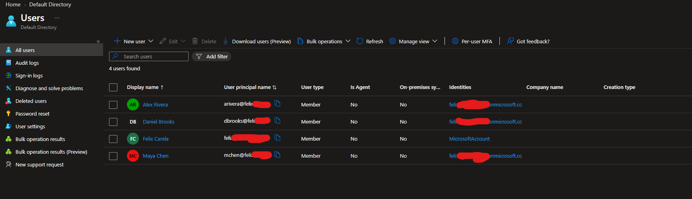
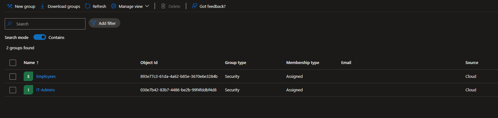
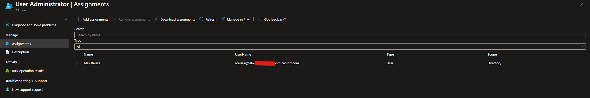
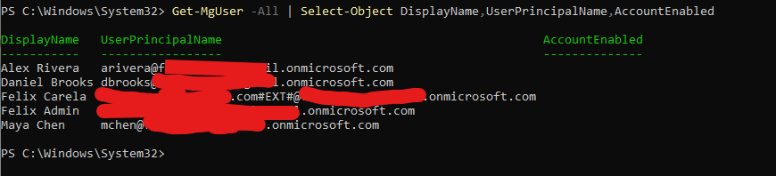
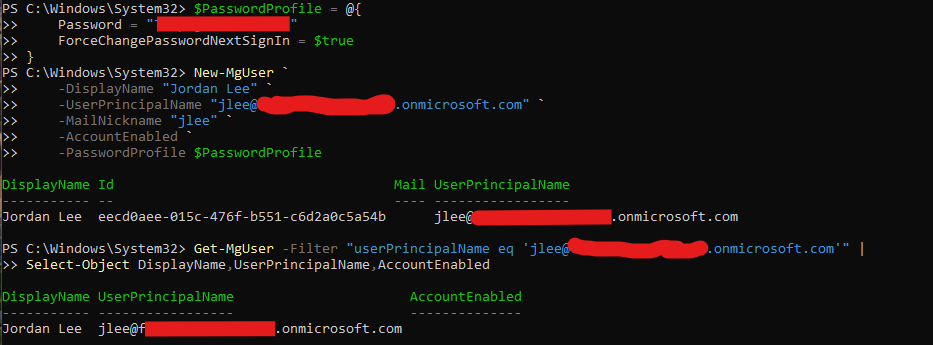
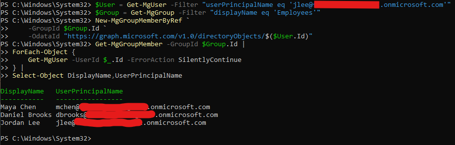
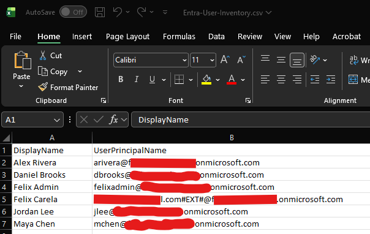
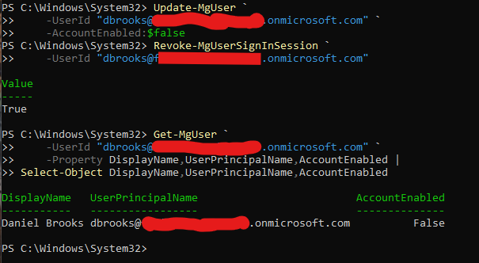

# Microsoft Entra ID Automation Lab

## Overview

This project demonstrates hands-on administration of Microsoft Entra ID using both the Microsoft Entra admin center and Microsoft Graph PowerShell.

The lab focuses on common identity administration tasks such as creating cloud users, managing security groups, assigning administrative roles, automating user creation and group membership, exporting user inventory data, and performing basic user offboarding actions.

The goal of the project was to demonstrate both GUI-based administration and PowerShell automation in a Microsoft Entra environment.

---

## Technologies Used

- Microsoft Entra ID
- Microsoft Entra admin center
- Microsoft Graph PowerShell
- PowerShell 7
- Microsoft Graph API
- Role-Based Access Control
- Security Groups
- CSV Reporting

---

# 1. Cloud User Administration

I created several cloud-only user accounts in Microsoft Entra ID to simulate a small organization.

The lab users included accounts such as:

- Alex Rivera
- Maya Chen
- Daniel Brooks

These accounts were created directly in the Microsoft Entra admin center.



This demonstrated basic Microsoft Entra user provisioning and cloud identity administration.

---

# 2. Security Group Management

I created security groups to organize users and simplify access management.

The groups included:

- `IT-Admins`
- `Employees`

Users were assigned to the appropriate group based on their simulated role within the organization.



This demonstrated group-based identity management and the use of security groups for administrative organization.

---

# 3. Administrative Role Assignment

I assigned the **User Administrator** Microsoft Entra role to a lab user.

This demonstrated the concept of least-privilege administration by assigning a role that allows user-management tasks without granting full Global Administrator access.



This is an example of Role-Based Access Control in Microsoft Entra ID.

---

# 4. Microsoft Graph PowerShell Connection and User Query

I installed Microsoft Graph PowerShell and connected to the tenant using delegated permissions.

After authentication, I queried the Microsoft Entra user directory using:

```powershell
Get-MgUser -All |
Sort-Object DisplayName |
Select-Object DisplayName, UserPrincipalName, AccountEnabled
```



This demonstrated retrieving Microsoft Entra user information programmatically instead of relying only on the graphical admin portal.

---

# 5. User Creation with Microsoft Graph PowerShell

I created a new cloud user named **Jordan Lee** using Microsoft Graph PowerShell.

The user was created with `New-MgUser`, including the account name, user principal name, password profile, and account status.

Example:

```powershell
$PasswordProfile = @{
    Password = "TemporaryPassword"
    ForceChangePasswordNextSignIn = $true
}

New-MgUser `
    -DisplayName "Jordan Lee" `
    -UserPrincipalName "jlee@tenant.onmicrosoft.com" `
    -MailNickname "jlee" `
    -AccountEnabled `
    -PasswordProfile $PasswordProfile
```

The temporary password shown above is only an example and is not the password used in the lab.



This demonstrated automated user provisioning through Microsoft Graph.

---

# 6. Automated Group Membership

After creating Jordan Lee, I used Microsoft Graph PowerShell to add the account to the `Employees` security group.

The user and group objects were retrieved first:

```powershell
$User = Get-MgUser -Filter "userPrincipalName eq 'jlee@tenant.onmicrosoft.com'"

$Group = Get-MgGroup -Filter "displayName eq 'Employees'"
```

The account was then added to the group using:

```powershell
New-MgGroupMemberByRef `
    -GroupId $Group.Id `
    -OdataId "https://graph.microsoft.com/v1.0/directoryObjects/$($User.Id)"
```



This demonstrated automating group membership rather than performing the task manually in the Entra admin center.

---

# 7. User Inventory Reporting

I used Microsoft Graph PowerShell to export a user inventory report to CSV.

The report included:

- Display name
- User principal name
- Account enabled status

Example:

```powershell
$Desktop = [Environment]::GetFolderPath("Desktop")

Get-MgUser -All |
Select-Object DisplayName, UserPrincipalName, AccountEnabled |
Sort-Object DisplayName |
Export-Csv "$Desktop\Entra-User-Inventory.csv" -NoTypeInformation
```



This demonstrated how Microsoft Graph PowerShell can be used for identity reporting and administrative documentation.

---

# 8. User Offboarding Automation

I simulated a basic user offboarding workflow using the Daniel Brooks lab account.

The account was disabled with:

```powershell
Update-MgUser `
    -UserId "dbrooks@tenant.onmicrosoft.com" `
    -AccountEnabled:$false
```

Active sign-in sessions were then revoked using:

```powershell
Revoke-MgUserSignInSession `
    -UserId "dbrooks@tenant.onmicrosoft.com"
```

The account status was verified afterward.



This demonstrated two common offboarding actions:

- Preventing future account sign-ins
- Invalidating existing user sessions

After testing the workflow, the lab account was re-enabled.

---

## Security Considerations

During the Microsoft Graph authentication portion of the lab, Microsoft Entra Security Defaults temporarily prevented Microsoft Graph Command Line Tools authentication.

Security Defaults were temporarily disabled for troubleshooting and Graph testing, then **re-enabled after the lab work was completed**.

The project also used a dedicated cloud administrator account for Microsoft Graph administration rather than relying on a personal external identity.

---

## Skills Demonstrated

This project demonstrates hands-on experience with:

- Microsoft Entra ID administration
- Cloud user provisioning
- Security group management
- Microsoft Entra administrative roles
- Least-privilege access principles
- Microsoft Graph PowerShell
- PowerShell 7
- Delegated Graph permissions
- Automated user creation
- Automated group membership
- Identity reporting with CSV exports
- Account disabling and re-enabling
- Session revocation
- User offboarding workflows
- Authentication troubleshooting
- Microsoft Entra Security Defaults

---

## Project Outcome

The completed lab demonstrates administration of a Microsoft Entra cloud identity environment using both graphical and command-line tools.

Users and security groups were created and organized through the Microsoft Entra admin center, while Microsoft Graph PowerShell was used to automate identity-management tasks including user creation, group membership, reporting, and user offboarding.

This project demonstrates the ability to perform both manual Microsoft Entra administration and repeatable identity automation using PowerShell.
